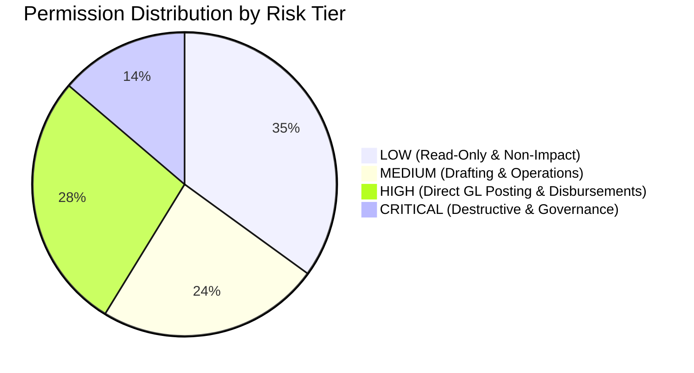
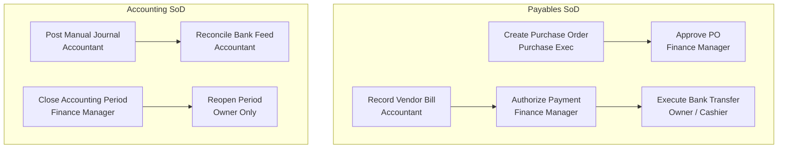

# Gate 5A — Settings, Roles, Permissions & Approval Architecture Design

```text
Document Version: 1.0.0
Author: Architecture & Financial Security Design Team
Target Platform: FirmBooks Financial Engine
Phase: Gate 5A Architecture & Specification Lock
Status: DESIGN COMPLETE — PENDING IMPLEMENTATION
```

---

## 1. Audit of Current Settings Panel & Configuration Inventory

The current application configuration is split between:
1. **Frontend Settings View** (`src/components/settings/`)
2. **Specialized Module Views** (Accounting, Banking, Projects, GST)
3. **Database Relational Models** (`organizations`, `organization_profiles`, `organization_members`, `mfa_credentials`, `approval_rules`, `document_sequences`, `period_locks`, `accounts`)
4. **Browser Local State** (`userPreferences` in `localStorage`)

### 1.1 Complete Current Settings Inventory

| Setting / Feature | UI Location | Backend Route | Database Storage | Permission Required | Working Status | Notes & Architectural Observations |
| :--- | :--- | :--- | :--- | :--- | :--- | :--- |
| **Legal / Trade Name** | Settings $\to$ Profile | `PATCH /organizations/current` | `organizations.name`, `organization_profiles.legal_name`, `trade_name` | `Owner` or `Admin` | **Working** | Persisted to PostgreSQL; validated between 2–120 chars. |
| **Industry & Company Logo** | Settings $\to$ Profile | `PATCH /organizations/current` | `organizations.industry`, `organization_profiles.logo_url` | `Owner` or `Admin` | **Working** | Base64/URL stored in profile; rendered on quotation PDFs. |
| **Company Contact (Email, Phone, Website)** | Settings $\to$ Profile | `PATCH /organizations/current` | `organization_profiles.email`, `phone`, `website` | `Owner` or `Admin` | **Working** | Used in invoice headers and customer communications. |
| **Registered Address & City/State/Postal** | Settings $\to$ Taxes & Address | `PATCH /organizations/current` | `organization_profiles.address_line1`, `address_line2`, `city`, `state`, `postal_code`, `country` | `Owner` or `Admin` | **Working** | Required for Place of Supply (POS) and GST tax calculations. |
| **Tax Identifiers (GSTIN, PAN, Tax ID)** | Settings $\to$ Taxes & Address | `PATCH /organizations/current` | `organization_profiles.gstin`, `pan`, `tax_id` | `Owner` or `Admin` | **Working** | Validated for 15-char GSTIN format and state code parity. |
| **Base Currency & Symbol** | Settings $\to$ Profile (Read-Only) | `GET /organizations/current` | `organizations.base_currency`, `currency_symbol` | N/A (Locked) | **Working** | Immutable once provisioned; cannot be mutated via PATCH. |
| **Fiscal Year Start Month** | Settings $\to$ Invoicing | `PATCH /organizations/current` | `organization_profiles.fiscal_year_start` | `Owner` or `Admin` | **Working** | Defaults to `April` (India standard); options `April` / `January`. |
| **Default Payment Terms** | Settings $\to$ Invoicing | `PATCH /organizations/current` | `organization_profiles.default_payment_terms` | `Owner` or `Admin` | **Working** | Standard terms `Net 15`, `Net 30`, `Net 60`, `Due on Receipt`. |
| **Document Number Prefixes** | Settings $\to$ Invoicing | `PATCH /organizations/current` | `organization_profiles.invoice_prefix`, `estimate_prefix`, `po_prefix`, `bill_prefix` | `Owner` or `Admin` | **Working** | Updates profile strings; sequence numbers increment in `document_sequences`. |
| **Invoice Footer Notes / Terms** | Settings $\to$ Invoicing | `PATCH /organizations/current` | `organization_profiles.invoice_notes` | `Owner` or `Admin` | **Working** | Appears on generated client invoice PDFs. |
| **Beneficiary Bank Details** | Settings $\to$ Bank Details | `PATCH /organizations/current` | `organization_profiles.bank_name`, `bank_account_number`, `bank_ifsc_swift` | `Owner` or `Admin` | **Working** | Settlement instructions for customer invoice payment stubs. |
| **User Profile (Name/Email)** | Settings $\to$ Identity | `None` (Mocked in UI) | `users.full_name`, `users.email` | `None` | `UI ONLY` | Displays error: "Profile edits unavailable until verified server update workflow enabled." |
| **User Password Change** | Settings $\to$ Identity | `POST /auth/change-password` | `users.password_hash`, `user_identities.password_hash` | Authenticated User | **Working** | Enforces 12-char min, updates hash, revokes existing sessions. |
| **Two-Factor Authentication (TOTP)** | Settings $\to$ 2FA / MFA | `GET /identity/mfa/status`<br>`POST /identity/mfa/enroll`<br>`POST /identity/mfa/verify` | `mfa_credentials.totp_secret_encrypted`, `recovery_code_hashes`, `is_verified`, `is_enforced` | Authenticated User | **Working** | RFC 6238 TOTP with QR code generation and emergency recovery codes. |
| **Workspace Governance Details** | Settings $\to$ Governance | `GET /organizations/current` | `organizations.uuid`, `public_org_id`, `status` | Authenticated Member | **Working** | Displays public & internal tenant IDs, read-only status banner. |
| **Display Preferences (Theme, Date, Timezone)** | Settings $\to$ Preferences | `None` (Client LocalStorage) | `localStorage` (`userPreferences`) | Authenticated User | **Working** | Client-side only; does not affect server date formatting. |
| **Team Member Invitations & Role Assignment** | Team Access View (`Sidebar`) | `GET /access/members`<br>`POST /access/invitations`<br>`PATCH /access/members/:id/role`<br>`DELETE /access/members/:id` | `organization_members`, `organization_invitations` | `settings.manage_users` | **Working** | Implements token-based email invites and direct role updates. |
| **Role & Permission Customization Matrix** | None | `GET /api/v1/security/roles` | Static `RbacService` (tables `roles`, `permissions`, `role_permissions` exist but empty) | `settings.manage_users` | `MISSING UI` | Backend returns static roles; dynamic role editor UI does not exist. |
| **Approval Rules Configuration** | None | `GET/POST /api/v1/security/approvals/rules` | `approval_rules` | `settings.approvals` | `MISSING UI` | Backend supports entity thresholds and approver roles; no settings UI. |
| **Approval Execution & Queue** | None | `POST /api/v1/security/approvals/approve`<br>`POST /api/v1/security/approvals/reject` | `approval_requests` | `settings.approvals` | `INCOMPLETE` | Endpoints exist, but transactional engines do not hard-block unapproved documents. |
| **Period Locks & Reopening** | Accounting $\to$ Period Locks | `GET/POST /api/v1/finance/period-locks`<br>`POST /api/v1/finance/period-close/reopen` | `period_locks`, `accounting_period_closes`, `accounting_period_close_events` | `settings.close_period` | **Working** | Locks transactions before date; requires Owner/Admin reason to reopen. |
| **Chart of Accounts Controls** | Accounting $\to$ COA | `GET/POST/PATCH /api/v1/finance/accounts` | `accounts` | `settings.manage_accounts` | **Working** | System accounts protected; hierarchy validated; direct posting toggled. |
| **Budgets Configuration** | Accounting $\to$ Budgets | `GET/POST /api/v1/finance/budgets` | `budgets`, `budget_lines` | `settings.manage_budgets` | **Working** | Monthly fiscal year account budgeting with variance reporting. |
| **Disaster Recovery & Backup Center** | Recovery Center View (`Sidebar`) | `GET/POST /recovery/artifacts`<br>`POST /recovery/artifacts/:id/stage`<br>`POST /recovery/jobs/:id/promote` | `recovery_artifacts`, `recovery_jobs`, `recovery_restore_jobs` | `settings.backup` (Owner only) | **Working** | Encrypted envelope creation, staging verification, and promotion. |
| **Active Session Inventory** | Settings $\to$ Active Sessions | `None` (`auth_sessions` table exists) | `auth_sessions` | Authenticated User | `MISSING UI` | Displays banner: "Session inventory is not enabled yet." |
| **Workflow Automation Engine** | Settings $\to$ Automation | `None` | None | `None` | `UI ONLY` | Displays banner: "Automation is not enabled yet." |

---

## 2. Proposed Settings Information Architecture

The redesigned Settings panel will be structured into 13 logical functional groups with clear domain boundaries:

```text
Settings
├── 1. Organisation
│   ├── Business Profile (Legal Name, Trade Name, Logo, Industry, Contact)
│   ├── Registered Address & Branches (Locations, POS States)
│   ├── Tax Identifiers (GSTIN, PAN, TAN, MSME Udyam)
│   └── Fiscal & Localization (Base Currency [Locked], Fiscal Year, Date/Timezone)
├── 2. Users & Organisation Members
│   ├── Active Members (Directory, Joined Date, Assigned Role, Status)
│   ├── Invitations (Pending Invites, Roles, Expiration, Revocation)
│   └── Access Deactivation & Offboarding
├── 3. Roles & Permissions
│   ├── System Roles (Owner, Admin, Finance Manager, Accountant, Sales, Purchase, Auditor, Approver)
│   ├── Custom Roles (Role Builder, Cloning, Permission Tree)
│   └── Role Assignment Matrix & High-Risk Permission Warnings
├── 4. Approval Workflows
│   ├── Purchase Order Approvals (Thresholds, Multi-Tier Approvers)
│   ├── Vendor Bill & Payment Approvals (Dual-Authorization Limits)
│   ├── Expense Approvals (Receipt Mandates, Department Limits)
│   ├── Manual Journal & Adjustment Approvals
│   ├── Credit Note & Write-Off Approvals
│   └── Self-Approval & Delegation Policies
├── 5. Accounting & General Ledger Defaults
│   ├── Control Accounts (Default AR, AP, Retained Earnings, Rounding, Tax Clearing)
│   ├── Journal Posting Controls (Direct GL Posting Rules, Mandatory Reference Fields)
│   ├── Period Closing & Transaction Locks (Fiscal Year End, Monthly Locks, Reopening Policy)
│   └── Opening Balances & Historical Migration Lock
├── 6. Sales Configuration
│   ├── Document Numbering Sequences (Invoices, Estimates, Sales Orders, Credit Notes, Delivery Challans)
│   ├── Commercial Terms (Standard Payment Terms, Early Settlement Discount, Late Fee Rules)
│   ├── Customer Credit Limit Policies & Duplicate Warning Thresholds
│   └── Customer Portal Preferences (Online Acceptance, Stripe/Razorpay Payments)
├── 7. Purchases Configuration
│   ├── Purchase Numbering Sequences (POs, Vendor Bills, Debit Notes)
│   ├── Vendor Credit & Advance Auto-Application Rules
│   ├── Duplicate Bill Detection Constraints
│   └── Vendor Portal Preferences (Bill Uploads, PO Confirmations)
├── 8. Expenses Configuration
│   ├── Expense Numbering & Tagging
│   ├── Default Payment & Clearing Accounts
│   ├── Receipt Attachment Mandates (Thresholds for Mandatory Digital Receipt)
│   └── Mileage & Per-Diem Rates (if enabled)
├── 9. Banking & Cash Configuration
│   ├── Connected / Internal Bank & Cash Ledger Accounts
│   ├── Bank Statement Parsers & Auto-Feed Configurations
│   ├── Reconciliation Rules Engine (Tolerance Bands, Pattern Matching Rules)
│   └── Inter-Account Transfer Posting Defaults
├── 10. GST / Tax Configuration
│   ├── GST Registrations (Multi-GSTIN Support by State)
│   ├── Tax Rates & HSN/SAC Code Registry
│   ├── Default Place of Supply (POS) Determination Rules
│   ├── TDS / TCS Withholding Tax Rules & Thresholds
│   └── E-Invoicing / E-Way Bill Credentials (Future-Ready)
├── 11. Projects & Timesheet Configuration
│   ├── Project Numbering & Classification
│   ├── Profitability Costing Methodology (Direct Expense + Labor vs Burdened)
│   ├── Default Hourly Billing Rates & Rounding Increments
│   └── Timesheet Approval & Invoice Sealing Policies
├── 12. Documents, Templates & Notifications
│   ├── Quotation & Invoice Visual Templates (Theme, Colors, Typography, Logo Placement)
│   ├── Tax Invoice Format Standards (GST-Compliant B2B / B2C Layouts)
│   ├── Email Notification Templates (Invoices, Receipts, Statements, Approval Requests)
│   └── Automated Overdue Payment Reminders (Cadence: -3d, Due, +7d, +14d, +30d)
└── 13. Security, Audit & Disaster Recovery
    ├── Workspace Security Policy (Mandatory 2FA/MFA, Session Timeout, IP Allowlist)
    ├── Active Sessions & Targeted Device Revocation
    ├── Immutable Audit Log Viewer & Verification Diagnostic Suite
    └── Disaster Recovery Center (Encrypted Artifact Export, Staging, Promotion)
```

### Feature Implementation Classification

| Proposed Setting Module | Implementation Status | Action Required in Engine / UI |
| :--- | :--- | :--- |
| **Organisation Profile & Tax Identifiers** | `CURRENTLY IMPLEMENTED` | Polish UX and link multi-state GSTIN records. |
| **Fiscal Year & Date Localization** | `CURRENTLY IMPLEMENTED` | Restrict fiscal year mutation once transactions exist. |
| **Team Invitations & Member Directory** | `CURRENTLY IMPLEMENTED` | Migrate standalone `TeamAccessView` directly into Settings tab. |
| **Roles & Dynamic Permission Matrix** | `BACKEND EXISTS — UI NEEDED` | Build interactive Permission Matrix and Role Builder UI. |
| **Approval Workflow Engine & Rules UI** | `BACKEND EXISTS — UI NEEDED` | Build visual threshold editor and wire transaction interceptors. |
| **Accounting Control Account Defaults** | `BACKEND EXISTS — UI NEEDED` | Add UI for setting default AR/AP/Retained Earnings accounts. |
| **Period Locks & Reopen Audit** | `CURRENTLY IMPLEMENTED` | Connect directly to Settings navigation. |
| **Document Numbering Formats** | `CURRENTLY IMPLEMENTED` | Add visual sequence format preview (e.g., `INV/{YYYY}-{YY}/{0000}`). |
| **Receipt Attachment Mandates** | `NEW FEATURE` | Implement organization setting `require_receipt_above_amount`. |
| **Bank Reconciliation Rules Engine** | `CURRENTLY IMPLEMENTED` | Wire rule builder UI into Settings $\to$ Banking. |
| **Customer / Vendor Portal Settings** | `NEW FEATURE` | Design tokenized portal authentication and preferences. |
| **Visual Document Template Designer** | `CURRENTLY IMPLEMENTED` | Expose Quotation / Invoice template styling in Settings $\to$ Documents. |
| **Automated Overdue Email Cadence** | `BACKEND EXISTS — UI NEEDED` | Connect `EmailOutboxService` with configurable reminder rules. |
| **Session Inventory & Targeted Revoke** | `BACKEND EXISTS — UI NEEDED` | Expose `auth_sessions` table in Settings $\to$ Security. |
| **Disaster Recovery Artifact Management**| `CURRENTLY IMPLEMENTED` | Embed `RecoveryCenterView` directly into Settings $\to$ Security. |

---

## 3. Granular Permission Taxonomy Design

To eliminate broad privileges (e.g. `purchases.create` allowing bills, payments, voids, and debit notes simultaneously), FirmBooks adopts a strict **`resource.action`** naming taxonomy.

### Taxonomy Syntax Rules:
1. **Lowercase ASCII only**, separated by a dot (`.`).
2. **Resource**: Plural noun identifying the business entity (e.g., `invoices`, `purchase_orders`, `bank_reconciliations`, `periods`).
3. **Action**: Verb identifying the precise operation (`view`, `create`, `edit`, `post`, `approve`, `void`, `allocate`, `reverse`, `import`, `export`, `close`, `reopen`, `manage`).

---

## 4. Sales & Receivables Permissions

| Permission Code | Risk Level | Description | Dependent Permissions |
| :--- | :---: | :--- | :--- |
| `customers.view` | **LOW** | View customer directory, addresses, and contacts. | None |
| `customers.create` | **MEDIUM** | Register new customer accounts in the master registry. | `customers.view` |
| `customers.edit` | **MEDIUM** | Modify customer billing addresses, GSTIN, and credit terms. | `customers.view` |
| `customers.archive` | **MEDIUM** | Deactivate/archive customer master records without transactions. | `customers.view` |
| `estimates.view` | **LOW** | View quotation and estimate records. | None |
| `estimates.create` | **MEDIUM** | Author draft quotations and revisions. | `estimates.view`, `customers.view`, `items.view` |
| `estimates.edit` | **MEDIUM** | Modify draft or sent quotations before acceptance. | `estimates.view` |
| `estimates.send` | **LOW** | Dispatch quotation PDFs to client emails. | `estimates.view` |
| `estimates.convert` | **HIGH** | Convert accepted quotation into a Sales Order or Invoice. | `estimates.view`, `invoices.create` |
| `estimates.delete` | **MEDIUM** | Delete unaccepted draft quotations. | `estimates.view` |
| `sales_orders.view` | **LOW** | View sales order registry and fulfillment status. | None |
| `sales_orders.create`| **MEDIUM** | Create confirmed sales orders. | `sales_orders.view`, `customers.view` |
| `sales_orders.edit` | **MEDIUM** | Update items or quantities on open sales orders. | `sales_orders.view` |
| `sales_orders.convert`| **HIGH** | Convert confirmed sales order to a posted Invoice. | `sales_orders.view`, `invoices.create` |
| `sales_orders.cancel` | **MEDIUM** | Cancel unfulfilled sales order commitments. | `sales_orders.view` |
| `delivery_challans.view` | **LOW** | View goods dispatch and delivery challans. | None |
| `delivery_challans.create` | **MEDIUM** | Issue goods delivery challan for warehouse transport. | `delivery_challans.view`, `customers.view` |
| `invoices.view` | **LOW** | View invoice records, PDF previews, and balances. | None |
| `invoices.create` | **HIGH** | Create and post sales invoices to General Ledger. | `invoices.view`, `customers.view`, `items.view` |
| `invoices.send` | **LOW** | Email tax invoice PDF to customer contact. | `invoices.view` |
| `invoices.void` | **CRITICAL** | Cancel posted invoice and reverse General Ledger postings. | `invoices.view` |
| `invoices.write_off`| **CRITICAL** | Write off uncollectible AR bad debt to expense account. | `invoices.view` |
| `customer_payments.view` | **LOW** | View payment receipts and allocation stubs. | None |
| `customer_payments.create` | **HIGH** | Record customer remittance against open invoices. | `customer_payments.view`, `invoices.view` |
| `customer_payments.allocate` | **HIGH** | Allocate unapplied customer advances to open invoices. | `customer_payments.view`, `invoices.view` |
| `customer_payments.reverse` | **CRITICAL** | Void payment receipt and reinstate invoice balance due. | `customer_payments.view` |
| `credit_notes.view` | **LOW** | View credit note records and available balances. | None |
| `credit_notes.create` | **HIGH** | Issue sales credit note / return with GST credit ledger entry. | `credit_notes.view`, `customers.view` |
| `credit_notes.apply` | **HIGH** | Apply available credit balance to reduce invoice balance. | `credit_notes.view`, `invoices.view` |
| `credit_notes.refund`| **HIGH** | Process bank payout refund for unapplied customer credit. | `credit_notes.view`, `bank_transactions.view` |
| `credit_notes.void` | **CRITICAL** | Void unallocated credit note and reverse GL tax adjustments. | `credit_notes.view` |

---

## 5. Purchases & Payables Permissions

| Permission Code | Risk Level | Description | Dependent Permissions |
| :--- | :---: | :--- | :--- |
| `vendors.view` | **LOW** | View vendor directory, bank accounts, and addresses. | None |
| `vendors.create` | **MEDIUM** | Register new supplier / vendor accounts. | `vendors.view` |
| `vendors.edit` | **MEDIUM** | Update vendor tax details, bank account, and payment terms. | `vendors.view` |
| `vendors.archive` | **MEDIUM** | Archive inactive vendor records without open balances. | `vendors.view` |
| `purchase_orders.view` | **LOW** | View purchase orders and committed purchase totals. | None |
| `purchase_orders.create` | **MEDIUM** | Issue draft purchase order commitments to suppliers. | `purchase_orders.view`, `vendors.view` |
| `purchase_orders.edit` | **MEDIUM** | Update draft PO quantities and pricing before submission. | `purchase_orders.view` |
| `purchase_orders.submit` | **MEDIUM** | Submit purchase order to approval workflow. | `purchase_orders.view` |
| `purchase_orders.approve` | **HIGH** | Authorize submitted PO commitment above budget threshold. | `purchase_orders.view` |
| `purchase_orders.cancel` | **MEDIUM** | Cancel unbilled purchase order commitments. | `purchase_orders.view` |
| `purchase_orders.convert_to_bill` | **HIGH** | Convert confirmed PO into a posted vendor Bill. | `purchase_orders.view`, `bills.create` |
| `bills.view` | **LOW** | View vendor bills, line items, and AP due dates. | None |
| `bills.create` | **HIGH** | Post vendor bill to Accounts Payable and Expense/Asset GL. | `bills.view`, `vendors.view` |
| `bills.void` | **CRITICAL** | Void posted vendor bill and reverse AP ledger liability. | `bills.view` |
| `vendor_payments.view` | **LOW** | View vendor disbursement records and payment vouchers. | None |
| `vendor_payments.create` | **HIGH** | Record cash/bank disbursement settling vendor bills. | `vendor_payments.view`, `bills.view` |
| `vendor_payments.allocate` | **HIGH** | Apply unallocated vendor advance to open bills. | `vendor_payments.view`, `bills.view` |
| `vendor_payments.reverse` | **CRITICAL** | Void vendor payment voucher and restore AP liability. | `vendor_payments.view` |
| `vendor_advances.view` | **LOW** | View vendor prepayment and advance asset records. | None |
| `vendor_advances.create` | **HIGH** | Disburse advance payment to supplier before bill receipt. | `vendor_advances.view`, `vendors.view` |
| `vendor_advances.apply` | **HIGH** | Consume vendor advance to reduce payable bill balance. | `vendor_advances.view`, `bills.view` |
| `vendor_advances.reverse` | **CRITICAL** | Void unapplied vendor advance voucher. | `vendor_advances.view` |
| `vendor_credits.view` | **LOW** | View supplier debit notes and vendor credit balances. | None |
| `vendor_credits.create` | **HIGH** | Record supplier debit note / purchase return. | `vendor_credits.view`, `vendors.view` |
| `vendor_credits.apply` | **HIGH** | Apply vendor credit to reduce outstanding bill balance. | `vendor_credits.view`, `bills.view` |
| `vendor_credits.refund` | **HIGH** | Receive bank refund for unapplied vendor credit. | `vendor_credits.view` |
| `vendor_credits.void` | **CRITICAL** | Void unapplied vendor credit and reverse tax adjustments. | `vendor_credits.view` |

---

## 6. Expenses, Accounting & Banking Permissions

### 6.1 Expenses
| Permission Code | Risk Level | Description | Dependent Permissions |
| :--- | :---: | :--- | :--- |
| `expenses.view` | **LOW** | View operating expense transactions and receipts. | None |
| `expenses.create` | **HIGH** | Post direct cash/bank operating expense to GL. | `expenses.view`, `accounts.view` |
| `expenses.edit_draft` | **MEDIUM** | Edit unsubmitted / draft expense claims. | `expenses.view` |
| `expenses.submit` | **LOW** | Submit draft expense claim for approval. | `expenses.view` |
| `expenses.approve` | **HIGH** | Authorize employee expense reimbursement / posting. | `expenses.view` |
| `expenses.void` | **CRITICAL** | Void posted operating expense and reverse GL cash/expense lines. | `expenses.view` |
| `expenses.attach_receipt` | **LOW** | Upload digital receipt image/PDF to expense record. | `expenses.view` |

### 6.2 Accounting & General Ledger
| Permission Code | Risk Level | Description | Dependent Permissions |
| :--- | :---: | :--- | :--- |
| `accounts.view` | **LOW** | View Chart of Accounts tree and current balances. | None |
| `accounts.create` | **MEDIUM** | Add new ledger account in appropriate category. | `accounts.view` |
| `accounts.edit` | **HIGH** | Rename account or update reporting classification. | `accounts.view` |
| `accounts.archive` | **HIGH** | Archive unused account with zero lifetime balance. | `accounts.view` |
| `journals.view` | **LOW** | View manual journal entry vouchers and line debits/credits. | None |
| `journals.create` | **MEDIUM** | Draft manual journal entries for review. | `journals.view`, `accounts.view` |
| `journals.post` | **HIGH** | Post manual journal entry directly to General Ledger. | `journals.view`, `accounts.view` |
| `journals.reverse` | **CRITICAL** | Post reversing journal entry to cancel previous posting. | `journals.view` |
| `periods.view` | **LOW** | View accounting period lock status and close history. | None |
| `periods.close` | **HIGH** | Execute formal monthly/fiscal period close checklist. | `periods.view`, `reports.financial_statements` |
| `periods.lock` | **HIGH** | Set freeze date preventing backdated transaction entry. | `periods.view` |
| `periods.unlock` | **CRITICAL** | Reopen locked accounting period (Requires Owner authorization & audit reason). | `periods.view` |
| `opening_balances.view` | **LOW** | View historical opening balance schedule. | None |
| `opening_balances.manage` | **CRITICAL** | Set or adjust organization historical opening balances. | `accounts.view`, `opening_balances.view` |
| `fixed_assets.view` | **LOW** | View fixed asset registry, acquisition cost, and schedules. | None |
| `fixed_assets.manage` | **HIGH** | Register assets, run monthly depreciation, and record disposals. | `fixed_assets.view`, `accounts.view` |

### 6.3 Banking & Cash Operations
| Permission Code | Risk Level | Description | Dependent Permissions |
| :--- | :---: | :--- | :--- |
| `banking.view` | **LOW** | View bank account balances and transaction activity. | None |
| `bank_accounts.create` | **HIGH** | Connect new bank or petty cash account in system. | `banking.view`, `accounts.view` |
| `bank_accounts.edit` | **HIGH** | Update bank account routing, account number, or limits. | `banking.view` |
| `bank_transactions.view` | **LOW** | View feed of imported bank statement line transactions. | `banking.view` |
| `bank_statements.import` | **MEDIUM** | Upload OFX/QIF/CSV bank statements into staging feed. | `banking.view` |
| `bank_reconciliation.view` | **LOW** | View bank reconciliation dashboard and matched items. | `banking.view` |
| `bank_reconciliation.match` | **MEDIUM** | Match statement line against existing invoice/bill journal. | `bank_reconciliation.view` |
| `bank_reconciliation.reconcile` | **HIGH** | Formally close and certify bank reconciliation session. | `bank_reconciliation.view` |
| `bank_reconciliation.unreconcile` | **HIGH** | Break existing bank reconciliation match. | `bank_reconciliation.view` |
| `bank_transfers.create` | **HIGH** | Record inter-bank transfer between organization accounts. | `banking.view`, `accounts.view` |

---

## 7. Reports, Projects, Administration & Security Permissions

### 7.1 Reports & Analytics
| Permission Code | Risk Level | Description | Dependent Permissions |
| :--- | :---: | :--- | :--- |
| `reports.view` | **LOW** | Access general operational reports (sales, purchases). | None |
| `reports.financial_statements` | **HIGH** | Access Balance Sheet, Profit & Loss, and Trial Balance. | `reports.view` |
| `reports.receivables` | **MEDIUM** | View AR Aging, Customer Statements, and Collection reports. | `reports.view` |
| `reports.payables` | **MEDIUM** | View AP Aging, Vendor Statements, and Cash Requirement reports. | `reports.view` |
| `reports.gst` | **HIGH** | View GSTR-1, GSTR-3B, and Tax Liability summaries. | `reports.view` |
| `reports.bank` | **MEDIUM** | View Bank Reconciliation Statement and Cash Flow forecast. | `reports.view` |
| `reports.projects` | **MEDIUM** | View project profitability and unbilled WIP reports. | `reports.view` |
| `reports.audit` | **HIGH** | View tamper-evident audit logs and financial integrity diagnostics. | `reports.view` |
| `reports.export` | **MEDIUM** | Download Excel / CSV / PDF exports of financial reports. | `reports.view` |

### 7.2 Projects & Timesheets
| Permission Code | Risk Level | Description | Dependent Permissions |
| :--- | :---: | :--- | :--- |
| `projects.view` | **LOW** | View active projects, milestones, and task schedules. | None |
| `projects.create` | **MEDIUM** | Create new project workspace and budget. | `projects.view` |
| `projects.edit` | **MEDIUM** | Update project deliverables, assignees, and deadlines. | `projects.view` |
| `projects.financials` | **HIGH** | View project commercial margins, revenues, and actual costs. | `projects.view` |
| `projects.time_entries` | **LOW** | Log billable and non-billable employee hours. | `projects.view` |
| `projects.invoice_time` | **HIGH** | Seal unbilled time entries and generate client invoice. | `projects.view`, `invoices.create` |

### 7.3 Administration, Roles & Security
| Permission Code | Risk Level | Description | Dependent Permissions |
| :--- | :---: | :--- | :--- |
| `users.view` | **LOW** | View organization member roster and invitation status. | None |
| `users.invite` | **MEDIUM** | Send email invitations to new workspace members. | `users.view` |
| `users.deactivate` | **HIGH** | Revoke membership access for active organization members. | `users.view` |
| `roles.view` | **LOW** | View system and custom role definitions. | None |
| `roles.manage` | **CRITICAL** | Create, clone, or modify custom roles and permissions. | `roles.view` |
| `settings.view` | **LOW** | View organization profile, address, and preferences. | None |
| `settings.manage` | **HIGH** | Modify company profile, branding, prefixes, and terms. | `settings.view` |
| `settings.financial_config` | **CRITICAL** | Modify accounting control accounts, GSTIN, and tax rules. | `settings.view`, `accounts.view` |
| `approvals.manage` | **HIGH** | Configure entity threshold limits and approver assignments. | `settings.view` |
| `audit.view` | **HIGH** | Access full cryptographic audit stream and user actions. | None |
| `security.manage` | **CRITICAL** | Configure workspace 2FA enforcement and session policies. | `settings.view` |
| `backup.view` | **HIGH** | View available backup snapshots and recovery jobs. | None |
| `backup.create` | **HIGH** | Generate encrypted point-in-time organization backup. | `backup.view` |
| `backup.restore` | **CRITICAL** | Promote recovery artifact to replace current organization data. (Owner Only). | `backup.view` |

---

## 8. High-Risk & Critical Permission Classification

To safeguard financial data against accidental damage or insider misuse, all permissions are categorized into four operational tiers:

```text
CRITICAL (Destructive / Governance) ─── Requires Owner or Dual-Control Confirmation + Audit Event
HIGH (Financial State Mutation)     ─── Requires Manager Role + Ledger Impact Validation
MEDIUM (Operational Records)        ─── Standard Business Record Creation & Updates
LOW (Read-Only & Drafting)          ─── Read-Only Visibility & Basic Operations
```



### Critical Permission Safeguards:
1. **`periods.unlock`**: Must prompt for an explicit audit reason; alerts all Organization Owners via email.
2. **`backup.restore`**: Restricted exclusively to Organization `Owner`; requires password re-authentication.
3. **`invoices.void` / `bills.void` / `journals.reverse`**: Forbidden if associated payments/allocations exist; always generates an immutable audit record.
4. **`settings.financial_config`**: Prohibited from modifying base currency or control accounts after transactions exist without a certified migration script.

---

## 9. Standard System Roles Architecture

FirmBooks provides **8 predefined System Roles** designed to match standard corporate segregation of duties:

```text
1. Owner                ─── Unlimited authority; exclusive rights to disaster recovery and tenant ownership.
2. Admin                ─── Workspace administration, user management, and operational configuration.
3. Finance Manager      ─── Full GL oversight, approval authorizations, period closing, and financial reports.
4. Accountant           ─── Daily journal postings, bank reconciliations, invoice/bill entry, and tax filings.
5. Approver             ─── Dedicated authorization role for POs, expenses, and payments above thresholds.
6. Sales Executive      ─── Customer master, quotes, sales orders, invoice drafting, and collection viewing.
7. Purchase Executive   ─── Vendor master, purchase orders, bill drafting, and advance requests.
8. Auditor / Viewer     ─── Read-only visibility across ledgers, reports, and audit trails without entry privileges.
```

### Custom Role Architecture:
* **Storage Hierarchy**: `User` $\to$ `Organization Membership` $\to$ `Role` $\to$ `Permissions`.
* **System Roles Protected**: Predefined system roles (`is_system_role = true`) cannot be deleted or renamed.
* **Role Cloning**: Custom roles can be created by cloning any system role and toggling granular permissions.
* **Per-User Overrides Prohibited**: To prevent permission drift and un-audited privilege creep, permissions are strictly assigned to Roles, never directly to individual users.

---

## 10. Approval Workflow Engine Architecture

### 10.1 Multi-Tier Trigger Model
When a transaction is submitted, the engine evaluates organization-specific approval rules:

```text
Incoming Transaction (PO, Bill, Payment, Expense, Journal, Credit Note)
  │
  ▼
Is Approval Enabled for Entity Type? ──No──► Post Immediately to General Ledger
  │ Yes
  ▼
Amount >= Configured Threshold?      ──No──► Post Immediately to General Ledger
  │ Yes
  ▼
Set Transaction Status to 'PENDING_APPROVAL'
Create Record in `approval_requests`
Dispatch In-App & Email Notification to Assigned Approver Role
  │
  ├──► Approver 'APPROVES' ──► Status = 'APPROVED' ──► Trigger GL Posting & Allocation
  └──► Approver 'REJECTS'  ──► Status = 'REJECTED' ──► Unlock / Revert to Draft
```

### 10.2 Recommended Entity Approval Standards

| Entity Type | Recommended Default Policy | Typical Threshold Trigger | Required Approver Role |
| :--- | :---: | :--- | :--- |
| **Purchase Orders** | `OPTIONAL` | PO Amount > ₹50,000 | `Finance Manager` or `Owner` |
| **Vendor Bills** | `OPTIONAL` | Bill Amount > ₹1,00,000 | `Finance Manager` |
| **Vendor Payments** | `RECOMMENDED` | Outflow > ₹50,000 | `Finance Manager` or `Owner` |
| **Direct Operating Expenses** | `RECOMMENDED` | Expense > ₹10,000 | `Finance Manager` |
| **Manual Journal Entries** | `RECOMMENDED` | Journal Line Total > ₹1,00,000 | `Finance Manager` |
| **Credit Notes & Returns** | `OPTIONAL` | Credit Amount > ₹25,000 | `Finance Manager` |
| **Receivable Write-Offs** | `REQUIRED` | Any Bad Debt Write-Off | `Owner` or `Admin` |
| **Period Reopening** | `REQUIRED` | Any Reopen Action | `Owner` |

### 10.3 Self-Approval Policy
* **Core Rule**: An initiator **cannot approve their own financial submission** if an approval workflow is enforced.
* **Organization Configuration**:
  ```typescript
  export interface ApprovalPolicySettings {
    allowSelfApproval: boolean; // Default: FALSE
    requireDualAuthorizationAbove: number; // e.g., ₹5,00,000 requires 2 distinct approvers
    autoExpireDays: number; // e.g., 7 days before unapproved request expires
  }
  ```

---

## 11. Segregation of Duties (SoD) Framework

Finance compliance mandates strict separation between entry, approval, disbursement, and reconciliation:



### Incompatible Role Combinations & Conflict Rules:
1. **Bill Creation + Payment Execution**: An actor who enters vendor bills should not be the sole authorizer of disbursements to those vendors.
2. **Bank Reconciliation + Period Unlocking**: The reconciliation operator must not have unilateral authority to reopen closed historical periods.
3. **Customer Master Management + Bad Debt Write-Off**: Sales staff should not possess authority to write off customer receivable balances.

*(See [`SEGREGATION_OF_DUTIES_MATRIX.md`](file:///c:/Users/HI/Desktop/APP/finance%20app/SEGREGATION_OF_DUTIES_MATRIX.md) for full conflict analysis).*

---

## 12. Settings Security & Financial Immutability Policy

### 12.1 Dangerous Financial Configuration Classification

Settings that alter the mathematical foundation of the general ledger are classified as **`FINANCIAL CONFIGURATION`** and governed by immutability constraints:

| Setting Parameter | Risk Level | Immutability Rule After Financial Transactions Exist | Authorized Role | Confirmation Required |
| :--- | :---: | :--- | :---: | :---: |
| **Base Currency** | `CRITICAL` | **Strictly Immutable**. Cannot be changed once journals exist. | None | N/A |
| **AR Control Account** | `CRITICAL` | Immutable if open customer invoices exist. | `Owner` | Type "CHANGE CONTROL ACCOUNT" |
| **AP Control Account** | `CRITICAL` | Immutable if open vendor bills exist. | `Owner` | Type "CHANGE CONTROL ACCOUNT" |
| **Retained Earnings Account** | `CRITICAL` | Immutable once period close has executed. | `Owner` | Admin Password Re-auth |
| **GST Registration State** | `CRITICAL` | Immutable for past periods; applies only to future fiscal quarters. | `Owner` | Dual-Check Verification |
| **Document Number Prefixes** | `HIGH` | Prefix change takes effect on next sequence; prior documents immutable. | `Admin` | Standard Save |
| **Rounding Methodology** | `HIGH` | Applies prospectively; historical rounding adjustments locked. | `Finance Manager` | Standard Save |
| **Period Lock Date** | `HIGH` | Lock date can be moved forward freely; moving backward requires `periods.unlock`. | `Finance Manager` | Audit Reason Required |

### 12.2 Settings Change Audit Trail
Every mutation of an organization setting records an immutable entry in `audit_logs`:
* **Before State**: JSON snapshot of previous parameters.
* **After State**: JSON snapshot of updated parameters.
* **Actor & IP**: Authenticated user ID, role, client IP address, and timestamp.
* **Cryptographic Hash**: Chain-hashed with `previous_hash` and `current_hash` to ensure tamper detection.

---

## 13. Settings UI / UX Architecture

### 13.1 Two-Tier Navigation Layout (Desktop & Responsive)

```text
┌─────────────────────────────────────────────────────────────────────────────────────────────┐
│ Settings Header: Organization Switcher · Global Search · Unsaved Changes Warning Badge      │
├──────────────────────────────┬──────────────────────────────────────────────────────────────┤
│ Sidebar Navigation Groups    │ Main Content Workspace Area                                  │
│                              │                                                              │
│ 🏢 ORGANISATION              │ ┌──────────────────────────────────────────────────────────┐ │
│  • Company Profile           │ │ Section Heading: Invoicing & Numbering Defaults          │ │
│  • Taxes & Address           │ ├──────────────────────────────────────────────────────────┤ │
│  • Fiscal & Localization     │ │ [Live Preview Card: INV/2026-27/0042]                    │ │
│                              │ │                                                          │ │
│ 👥 USERS & ROLES             │ │ Invoice Prefix: [ INV-          ] Next #: [ 0042       ] │ │
│  • Member Directory          │ │ Estimate Prefix: [ EST-         ] Next #: [ 0015       ] │ │
│  • Roles & Permissions       │ │ PO Prefix:      [ PO-           ] Next #: [ 0008       ] │ │
│  • Approval Workflows        │ │                                                          │ │
│                              │ │ Default Payment Terms: [ Net 30 Days                 ▼ ] │ │
│ ⚖️ ACCOUNTING                │ │ Round-Off Rule:        [ Round to nearest rupee      ▼ ] │ │
│  • General Defaults          │ ├──────────────────────────────────────────────────────────┤ │
│  • Control Accounts          │ │ [⚠️ Warning: Sequence changes do not renumber past docs] │ │
│  • Period Closing & Locks    │ ├──────────────────────────────────────────────────────────┤ │
│                              │ │ [Cancel]                                 [Save Changes]  │ │
│ 📑 COMMERCIAL & OPERATIONS   │ └──────────────────────────────────────────────────────────┘ │
│  • Sales & Invoicing         │                                                              │
│  • Purchases & Payables      │                                                              │
│  • Operating Expenses        │                                                              │
│  • Banking & Cash Accounts   │                                                              │
│  • GST & Taxes               │                                                              │
│  • Projects & Timesheets     │                                                              │
│                              │                                                              │
│ 🛡️ SECURITY & COMPLIANCE     │                                                              │
│  • Security Policies & 2FA   │                                                              │
│  • Audit Trail Logs          │                                                              │
│  • Disaster Recovery Center  │                                                              │
└──────────────────────────────┴──────────────────────────────────────────────────────────────┘
```

### 13.2 Permission Matrix Interactive Role Builder UI
The Role Builder presents grouped permission modules with clear risk badges and hierarchical parent checkboxes:

```text
┌─────────────────────────────────────────────────────────────────────────────────────────────┐
│ Role: Finance Manager  [Clone System Role]  [Delete Role]                     [Save Role]   │
├─────────────────────────────────────────────────────────────────────────────────────────────┤
│ Search Permissions: [ Filter actions...                                                   ] │
├─────────────────────────────────────────────────────────────────────────────────────────────┤
│ 📦 Sales & Invoices                                          [Select All]  [Clear All]      │
│   [x] View Invoices (LOW)               [x] Create Invoices (HIGH)                          │
│   [x] Email Invoices (LOW)              [!] Void Invoices (CRITICAL - High Risk)            │
│   [x] Record Payments (HIGH)            [!] Write-Off Receivables (CRITICAL)                │
│                                                                                             │
│ 🛍️ Purchases & Payables                                     [Select All]  [Clear All]      │
│   [x] View Bills (LOW)                  [x] Create Bills (HIGH)                             │
│   [!] Void Bills (CRITICAL)             [x] Record Vendor Payments (HIGH)                   │
│   [x] Approve Purchase Orders (HIGH)    [x] Issue Debit Notes (HIGH)                        │
│                                                                                             │
│ ⚖️ Accounting & General Ledger                              [Select All]  [Clear All]      │
│   [x] View Chart of Accounts (LOW)      [x] Post Manual Journals (HIGH)                     │
│   [!] Reverse Journals (CRITICAL)       [x] Execute Period Close (HIGH)                     │
│   [ ] Unlock Closed Period (CRITICAL - Restricted to Owner)                                 │
└─────────────────────────────────────────────────────────────────────────────────────────────┘
```

---

## 14. Permission Migration Plan (Legacy $\to$ Granular)

To ensure zero downtime and prevent breaking existing users during rollout, legacy permissions will be mapped into the new granular taxonomy during schema upgrade:

| Legacy Permission Code | New Granular Permission Set | Migration Note |
| :--- | :--- | :--- |
| `invoices.view` | `customers.view`, `estimates.view`, `sales_orders.view`, `invoices.view`, `customer_payments.view`, `credit_notes.view`, `projects.view` | Preserves full read visibility across sales cycle. |
| `invoices.create` | `customers.create`, `estimates.create`, `sales_orders.create`, `invoices.create`, `credit_notes.create`, `projects.create` | Does NOT grant `invoices.void` or `invoices.write_off`. |
| `invoices.edit` | `customers.edit`, `estimates.edit`, `sales_orders.edit`, `credit_notes.apply` | Restricted to non-financial edits. |
| `invoices.receive_payment`| `customer_payments.create`, `customer_payments.allocate`, `customer_payments.reverse` | Granted to current payment handlers. |
| `invoices.delete` | `invoices.void`, `invoices.write_off` | Migrated to explicit critical void/write-off privileges. |
| `invoices.approve` | `estimates.convert`, `sales_orders.convert` | Replaced by explicit conversion permissions. |
| `purchases.view` | `vendors.view`, `purchase_orders.view`, `bills.view`, `vendor_payments.view`, `vendor_advances.view`, `vendor_credits.view` | Preserves full read visibility across procurement. |
| `purchases.create` | `vendors.create`, `purchase_orders.create`, `bills.create`, `vendor_advances.create`, `vendor_credits.create` | **Separation of Duties**: Does NOT automatically grant `vendor_payments.create` or `bills.void`. |
| `purchases.pay` | `vendor_payments.create`, `vendor_payments.allocate`, `vendor_advances.apply`, `vendor_credits.apply` | Explicit disbursement privileges. |
| `purchases.delete` | `bills.void`, `purchase_orders.cancel`, `vendor_credits.void` | Destructive payables privileges. |
| `expenses.create` | `expenses.create`, `expenses.attach_receipt` | Does NOT grant `expenses.void`. |
| `accounting.view` | `accounts.view`, `journals.view`, `periods.view`, `opening_balances.view`, `fixed_assets.view` | General Ledger view access. |
| `accounting.post` | `journals.create`, `journals.post`, `fixed_assets.manage` | Daily journal posting privileges; does NOT grant `periods.unlock`. |
| `settings.close_period` | `periods.close`, `periods.lock` | Standard close privilege; does NOT grant `periods.unlock` (Owner only). |
| `settings.manage_users` | `users.view`, `users.invite`, `users.deactivate`, `roles.view`, `roles.manage` | Member and role administration. |
| `settings.backup` | `backup.view`, `backup.create`, `backup.restore` | Disaster recovery management. |

---

## 15. Backend Authorization Architecture & Enforcement Design

### 15.1 Canonical Express Middleware
All route authorization will be unified under a single declarative middleware:

```typescript
// server/src/middleware/organizationIsolation.middleware.ts
export function requirePermission(permission: PermissionCode | PermissionCode[]) {
  return (req: AuthenticatedRequest, res: Response, next: NextFunction) => {
    const userRole = req.auth?.role;
    if (!userRole) {
      return res.status(401).json({ error: 'Unauthorized: Missing user role in token' });
    }

    const requiredPermissions = Array.isArray(permission) ? permission : [permission];
    const hasAccess = requiredPermissions.some((perm) => RbacService.hasPermission(userRole, perm));

    if (!hasAccess) {
      return res.status(403).json({
        error: `Forbidden: Role '${userRole}' lacks required permission: ${requiredPermissions.join(' or ')}`,
        requiredPermissions,
      });
    }

    next();
  };
}
```

### 15.2 Database-Driven Dynamic Role Resolution
`RbacService` will query `role_permissions` cached in memory with a 5-minute TTL per organization to support instant custom role updates:

```typescript
// server/src/auth/RbacService.ts
export class RbacService {
  public static async getPermissionsForRole(orgId: string, roleName: string): Promise<PermissionCode[]> {
    // 1. Check system role defaults
    if (SYSTEM_ROLE_PERMISSIONS[roleName]) {
      return SYSTEM_ROLE_PERMISSIONS[roleName];
    }
    // 2. Query custom role permissions from PostgreSQL
    const res = await db.query(
      `SELECT rp.permission_code
         FROM role_permissions rp
         JOIN roles r ON r.id = rp.role_id
        WHERE r.organization_id = $1 AND r.name = $2`,
      [orgId, roleName]
    );
    return res.rows.map((r) => r.permission_code as PermissionCode);
  }
}
```

---

## 16. Key Product Decisions Required

Before implementing Phase 5B code changes, the following business decisions must be confirmed by stakeholders:

1. **Dual-Authorization for High-Value Payments**: Should payments above a configurable limit (e.g. ₹5,00,000) mandate two distinct approvals (Accountant $\to$ Finance Manager $\to$ Owner)?
2. **Self-Approval in Single-User Orgs**: Should sole-proprietor organizations automatically bypass approval queues, or should approval rules only activate when team membership exceeds 1 user?
3. **Period Unlock Escalation**: Should unlocking a closed accounting period require two-factor authentication (TOTP) re-entry in addition to Owner role verification?
4. **Sales Order Invoicing Policy**: Can an Invoice be created directly without a Sales Order, or should organizations be able to mandate SO-backed invoicing?

---

## 17. Gate 5A Architecture Classification

```text
Existing Settings Architecture:  MODERATE (Core profile & tax working; UI gaps in roles/approvals)
Existing Permission Model:       MODERATE (Functional RBAC, but permissions overly coarse)
Proposed Architecture Readiness: READY FOR IMPLEMENTATION (Pending Stakeholder Decisions)
```

> **CRITICAL REMINDER**: Do NOT modify production source code during Gate 5A. Implementation of these specifications will proceed in Gate 5B.
