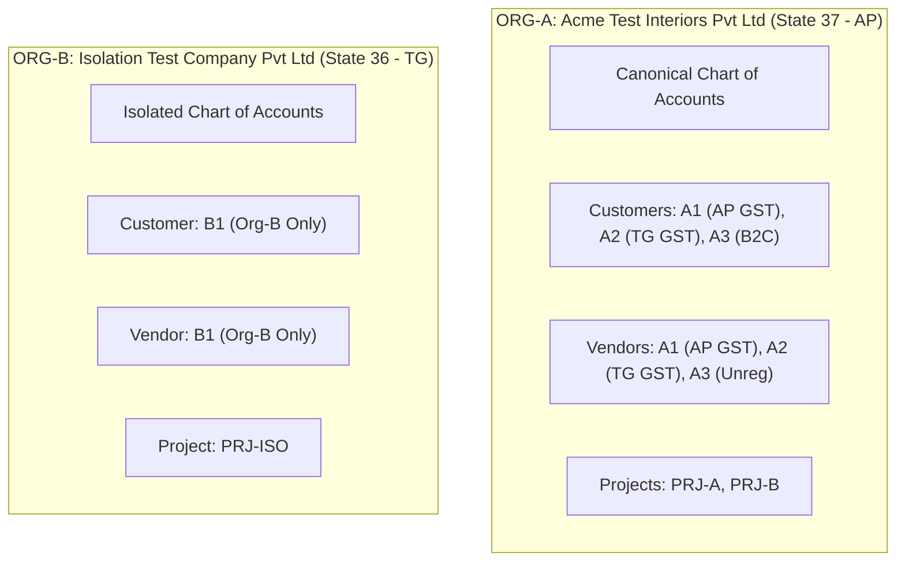

# FirmBooks Master Test Harness & Canonical Dataset Specification

## 1. Executive Summary & Overview

The **FirmBooks Master Test Harness** (`server/src/tests/fixtures/masterFinanceFixture.ts`) provides a deterministic, repeatable, multi-tenant accounting test environment designed to power invariant-driven property testing, adversarial testing, and enterprise production certification.

### Core Architectural Guarantees
1. **100% Determinism**: `setup()` and `reset()` guarantee identical initial database states regardless of test execution order.
2. **Multi-Tenant Isolation**: Two fully isolated organizations (`ORG-A` and `ORG-B`) with distinct GST jurisdictions (Andhra Pradesh `37` vs Telangana `36`).
3. **Double-Entry Equilibrium (`INV-01`)**: Every seeded transaction and transaction builder produces balanced debits and credits ($\sum \text{Dr} \equiv \sum \text{Cr}$).
4. **Subledger-to-GL Parity (`INV-04` & `INV-05`)**: Control accounts (AR `1100`, AP `2000`) match operational open item balances exactly to the cent.
5. **Database-Level Uniqueness**: Hardened database indexes preventing duplicate document sequences per organization.

---

## 2. Pre-Harness Database Hardening

Prior to fixture creation, database-level organization-scoped uniqueness constraints were verified and added to `server/src/database/migrationRunner.ts`:

| Table | Column | Index Name | Scope |
| :--- | :--- | :--- | :--- |
| `credit_notes` | `credit_note_number` | `uk_org_credit_note_number` | `(organization_id, credit_note_number)` |
| `vendor_credits` | `credit_number` | `uk_org_vendor_credit_number` | `(organization_id, credit_number)` |
| `sales_orders` | `sales_order_number` | `uk_org_sales_order_num` | `(organization_id, sales_order_number)` |
| `purchase_orders` | `purchase_order_number` | `uk_org_po_num` | `(organization_id, purchase_order_number)` |

### Invariant Verification
- **Same Organization**: Duplicate document numbers trigger database unique constraint violations.
- **Cross-Organization**: The same document sequence number in different organizations is permitted and completely isolated.

---

## 3. Organizations Master Data



| Field | ORG-A (Primary Tenant) | ORG-B (Isolation & Attack Tenant) |
| :--- | :--- | :--- |
| **ID** | `org-acme-ap` | `org-isolation-tg` |
| **UUID** | `uuid-acme-ap` | `uuid-isolation-tg` |
| **Public Org ID** | `PUB-ACME-AP` | `PUB-ISOL-TG` |
| **Org Code** | `ACME` | `ISOL` |
| **Legal Name** | `Acme Test Interiors Pvt Ltd` | `Isolation Test Company Pvt Ltd` |
| **Country** | `India` | `India` |
| **State** | `Andhra Pradesh` (State Code: `37`) | `Telangana` (State Code: `36`) |
| **GSTIN** | `37AAAAA0000A1Z5` | `36BBBBB0000B1Z6` |
| **Base Currency** | `INR` (`₹`) | `INR` (`₹`) |
| **Fiscal Year** | April $\rightarrow$ March | April $\rightarrow$ March |

---

## 4. User Personas & RBAC Matrix

| Persona | User ID | Email | Role | Organization |
| :--- | :--- | :--- | :--- | :--- |
| **Owner A** | `user-owner-a` | `owner@acme-test.com` | `Owner` | ORG-A |
| **Admin A** | `user-admin-a` | `admin@acme-test.com` | `Admin` | ORG-A |
| **Finance Manager A** | `user-manager-a` | `manager@acme-test.com` | `Manager` | ORG-A |
| **Accountant A** | `user-accountant-a` | `accountant@acme-test.com` | `Accountant` | ORG-A |
| **Sales Exec A** | `user-sales-a` | `sales@acme-test.com` | `Sales` | ORG-A |
| **Purchase Exec A** | `user-purchase-a` | `purchase@acme-test.com` | `Purchase` | ORG-A |
| **Auditor / Viewer A** | `user-viewer-a` | `viewer@acme-test.com` | `Viewer` | ORG-A |
| **Owner B** | `user-owner-b` | `owner@isolation-test.com` | `Owner` | ORG-B |
| **Accountant B** | `user-accountant-b` | `accountant@isolation-test.com` | `Accountant` | ORG-B |
| **Auditor / Viewer B** | `user-viewer-b` | `viewer@isolation-test.com` | `Viewer` | ORG-B |

---

## 5. Canonical Chart of Accounts (COA)

All accounts are scoped with deterministic IDs: `acc-${orgId}-${idSuffix}`.

| Code | ID Suffix | Account Name | Account Type | Sub-Type | Normal Balance |
| :--- | :--- | :--- | :--- | :--- | :--- |
| **1000** | `1000` | Petty Cash | Asset | Cash | Debit |
| **1010** | `1010` | HDFC Current Account | Asset | Bank | Debit |
| **1020** | `1020` | ICICI Current Account | Asset | Bank | Debit |
| **1100** | `1100` | Accounts Receivable (AR Control) | Asset | Accounts Receivable | Debit |
| **1150** | `1150` | Customer & Vendor Advances Asset | Asset | Current Asset | Debit |
| **1200** | `1200` | Input GST Tax Credit | Asset | Current Asset | Debit |
| **2000** | `2000` | Accounts Payable (AP Control) | Liability | Accounts Payable | Credit |
| **2100** | `2100` | Output GST Tax Payable | Liability | Taxes Payable | Credit |
| **2110** | `2110` | GST Input Tax Control | Liability | Taxes Payable | Credit |
| **2200** | `2200` | Sales Tax Payable | Liability | Taxes Payable | Credit |
| **3000** | `3000` | Owner Equity & Retained Earnings | Equity | Equity | Credit |
| **4000** | `4000` | Design & Consultation Revenue | Income | Sales | Credit |
| **4010** | `4010` | Execution & Turnkey Revenue | Income | Sales | Credit |
| **4090** | `4090` | Sales Returns & Allowances (Contra) | Income | Sales | Debit |
| **5000** | `5000` | Direct Material Purchases (COGS) | Cost of Goods Sold | Materials | Debit |
| **5010** | `5010` | Contractor & Subcontractor Cost | Cost of Goods Sold | Subcontractors | Debit |
| **5090** | `5090` | Purchase Returns (Contra Cost) | Cost of Goods Sold | Materials | Credit |
| **6000** | `6000` | Office & Administrative Expense | Expense | Office & Administrative | Debit |
| **6010** | `6010` | Office Rent & Facilities | Expense | Office & Administrative | Debit |
| **6020** | `6020` | Travel & Client Hospitality | Expense | Travel & Vehicle | Debit |
| **6030** | `6030` | Software & SaaS Subscriptions | Expense | Software & Subscriptions | Debit |

---

## 6. Customers & Vendors Master Dataset

### Customers

| Key | ID | Display Name | State | GSTIN | Tax Registration Status | Organization |
| :--- | :--- | :--- | :--- | :--- | :--- | :--- |
| **A1** | `cust-a1-same-state` | Customer A1 (AP GST Registered) | Andhra Pradesh (`37`) | `37AAAAA0000A1Z5` | Registered (Intra-State) | ORG-A |
| **A2** | `cust-a2-interstate` | Customer A2 (TG GST Registered) | Telangana (`36`) | `36BBBBB0000B1Z6` | Registered (Inter-State) | ORG-A |
| **A3** | `cust-a3-unregistered` | Customer A3 (B2C Consumer) | Andhra Pradesh (`37`) | `NULL` | Unregistered / B2C | ORG-A |
| **B1** | `cust-b1-org-b` | Customer B1 (Org B Dedicated) | Telangana (`36`) | `36CCCCC0000C1Z7` | Registered | ORG-B |

### Vendors

| Key | ID | Vendor Name | State | GSTIN | Tax Registration Status | Organization |
| :--- | :--- | :--- | :--- | :--- | :--- | :--- |
| **A1** | `vend-a1-same-state` | Vendor A1 (AP GST Registered) | Andhra Pradesh (`37`) | `37DDDDD0000D1Z8` | Registered (Intra-State) | ORG-A |
| **A2** | `vend-a2-interstate` | Vendor A2 (TG GST Registered) | Telangana (`36`) | `36EEEEE0000E1Z9` | Registered (Inter-State) | ORG-A |
| **A3** | `vend-a3-unregistered` | Vendor A3 (Local Hardware) | Andhra Pradesh (`37`) | `NULL` | Unregistered | ORG-A |
| **B1** | `vend-b1-org-b` | Vendor B1 (Org B Dedicated) | Telangana (`36`) | `36FFFFF0000F1Z0` | Registered | ORG-B |

---

## 7. Item & Service Master

| SKU | Item Name | Type | HSN / SAC | GST Rate | Sales Rate | Purchase Rate |
| :--- | :--- | :--- | :--- | :--- | :--- | :--- |
| `ITEM-000` | Zero-Tax Raw Timber | Goods | `4401` | 0% | ₹500.00 | ₹500.00 |
| `ITEM-005` | 5% Construction Aggregates | Goods | `2517` | 5% | ₹1,200.00 | ₹1,200.00 |
| `ITEM-012` | 12% Wooden Mouldings | Goods | `4409` | 12% | ₹2,500.00 | ₹2,500.00 |
| `ITEM-018` | 18% Commercial Plywood 18mm | Goods | `4412` | 18% | ₹4,000.00 | ₹4,000.00 |
| `ITEM-028` | 28% Luxury Designer Panelling | Goods | `9403` | 28% | ₹15,000.00 | ₹15,000.00 |
| `SERVICE-018`| 3D Architectural Visualization | Service | `9983` | 18% | ₹25,000.00 | ₹25,000.00 |

---

## 8. Projects

| ID | Code | Project Name | Client ID | Budget | Hourly Rate | Organization |
| :--- | :--- | :--- | :--- | :--- | :--- | :--- |
| `prj-a-exec` | `PRJ-A` | Executive Suite Interior Renovation | `cust-a1-same-state` | ₹2,500,000 | ₹1,500 | ORG-A |
| `prj-b-villa` | `PRJ-B` | Jubilee Hills Private Villa | `cust-a2-interstate` | ₹1,200,000 | ₹1,200 | ORG-A |
| `prj-iso-b` | `PRJ-ISO` | Isolation Facility Fitout | `cust-b1-org-b` | ₹500,000 | ₹1,000 | ORG-B |

---

## 9. Standard Transaction Builders

| Helper Method | Defaults | Expected Totals | Resulting Journal Entry |
| :--- | :--- | :--- | :--- |
| `createStandardInvoice()` | 25 qty @ ₹4,000 (18% GST) | Subtotal: ₹100k<br>GST: ₹18k<br>**Total: ₹118k** | **Dr 1100 AR ₹118,000**<br>**Cr 4000 Revenue ₹100,000**<br>**Cr 2100 Output GST ₹18,000** |
| `createStandardBill()` | 25 qty @ ₹4,000 (18% GST) | Taxable: ₹100k<br>GST: ₹18k<br>**Total: ₹118k** | **Dr 5000 COGS ₹100,000**<br>**Dr 2110 Input GST ₹18,000**<br>**Cr 2000 AP ₹118,000** |
| `createStandardExpense()` | Direct office supplies | **Gross: ₹11,800** | **Dr 6000 Office Exp ₹11,800**<br>**Cr 1010 Bank ₹11,800** |
| `createStandardCustomerPayment()` | Full settlement / on-account | **Amount: ₹118,000** | **Dr 1010 Bank ₹118,000**<br>**Cr 1100 AR ₹118,000** |
| `createStandardVendorPayment()` | Full bill remittance | **Amount: ₹118,000** | **Dr 2000 AP ₹118,000**<br>**Cr 1010 Bank ₹118,000** |
| `createStandardCreditNote()` | Partial sales return | Taxable: ₹10,000<br>GST: ₹1,800<br>**Total: ₹11,800** | **Dr 4000 Revenue ₹10,000**<br>**Dr 2100 Output GST ₹1,800**<br>**Cr 1100 AR ₹11,800** |
| `createStandardVendorCredit()` | Defective material debit note | Taxable: ₹10,000<br>GST: ₹1,800<br>**Total: ₹11,800** | **Dr 2000 AP ₹11,800**<br>**Cr 5000 COGS ₹10,000**<br>**Cr 2110 Input GST ₹1,800** |
| `createStandardVendorAdvance()` | Prepayment to vendor | **Amount: ₹50,000** | **Dr 1200 Advance Asset ₹50,000**<br>**Cr 1010 Bank ₹50,000** |
| `createStandardPurchaseOrder()` | 100 qty @ ₹4,000 | **Total: ₹472,000** | *(Operational - No immediate GL impact)* |

---

## 10. Master Assertion & Invariant Helpers

The test harness exposes mathematical financial assertion helpers providing rich diagnostic failure messages:

```typescript
// 1. Double-Entry Balance
await MasterFinanceFixture.assertJournalBalanced(journalEntryId);

// 2. Non-Negative Balances
await MasterFinanceFixture.assertNoNegativeDocumentBalance(organizationId);

// 3. Invoice Balance Equation (Total = Paid + Credited + WrittenOff + BalanceDue)
await MasterFinanceFixture.assertInvoiceBalanceCorrect(invoiceId, organizationId);

// 4. Bill Balance Equation (Total = Paid + Debited + WrittenOff + BalanceDue)
await MasterFinanceFixture.assertBillBalanceCorrect(billId, organizationId);

// 5. Payment Remittance Conservation (Payment = Allocated + Unallocated)
await MasterFinanceFixture.assertPaymentConservation(paymentId, organizationId);

// 6. Advance Conservation (Advance = Applied + Unapplied)
await MasterFinanceFixture.assertVendorAdvanceConservation(advanceId, organizationId);

// 7. Credit Note Conservation (Credit = Applied + Remaining)
await MasterFinanceFixture.assertCreditConservation(creditNoteId, organizationId);

// 8. AR Control Parity (GL 1100 == Open Invoices)
await MasterFinanceFixture.assertARSubledgerMatchesGL(organizationId);

// 9. AP Control Parity (GL 2000 == Open Bills)
await MasterFinanceFixture.assertAPSubledgerMatchesGL(organizationId);

// 10. Cross-Tenant Isolation Scan
await MasterFinanceFixture.assertTenantIsolation(orgAId, orgBId);

// 11. Reversal Symmetry
await MasterFinanceFixture.assertReversalSymmetry(originalJournalId, reversalJournalId);

// 12. Global Comprehensive Integrity
await MasterFinanceFixture.assertGlobalFinancialIntegrity(organizationId);
```

---

## 11. Test Execution Modes

| Mode | Purpose | Engine | Command |
| :--- | :--- | :--- | :--- |
| **Fast Mode** | Unit calculations, rounding, pure state transitions | `pg-mem` | `npm test` / `npx vitest run server/src/tests/masterFixtureDeterminism.test.ts` |
| **PostgreSQL Mode** | Concurrency, `SELECT ... FOR UPDATE`, row-level locking, migrations, race conditions | Real PostgreSQL | `DATABASE_URL=postgres://... npm test` |

---

## 12. Fixture Determinism Certification (`FIXTURE-001` to `FIXTURE-008`)

The fixture self-tests in `server/src/tests/masterFixtureDeterminism.test.ts` verify:
- `FIXTURE-001` (Setup Idempotency): Running fixture setup twice generates byte-for-byte identical logical state.
- `FIXTURE-002` (Tenant Isolation): No Org A records are visible to Org B queries and vice-versa.
- `FIXTURE-003` (COA Resolution): All 21 canonical account codes resolve correctly.
- `FIXTURE-004` (Transaction Builders): Standard sales and purchase builders create mathematically accurate GL postings.
- `FIXTURE-005` (Clean GL): Fresh fixture initializes with zero unbalanced entries and zero subledger discrepancies.
- `FIXTURE-006` (No Orphan Records): Zero dangling allocations or unlinked transaction records.
- `FIXTURE-007` (Tax Master): All items and services match configured GST brackets (0%, 5%, 12%, 18%, 28%).
- `FIXTURE-008` (Reset Cleanliness): Full mutation teardown restores clean initial state with zero residue.
