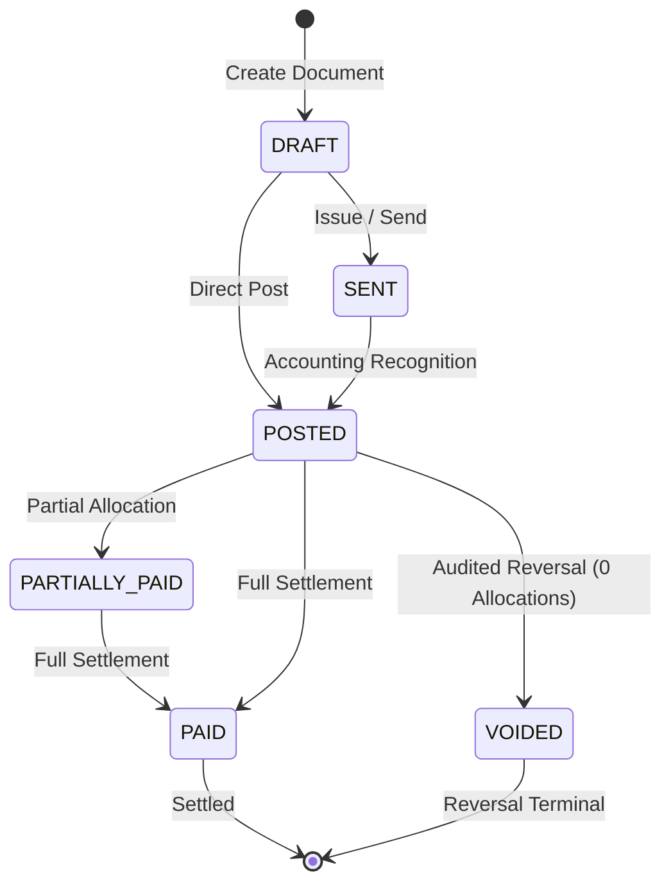

# FirmBooks Transaction State-Machine & Lifecycle Matrix

## 1. Executive Overview

This document specifies the exact, verified state machines, valid transitions, prohibited actions, terminal states, reversal mechanisms, period lock interactions, and allocation rules for all 15 core transactional entities in FirmBooks.

---

## 2. Master Entity State Inventory

---

## 3. Entity State Matrices

### 1. Quotation / Estimate (`estimates`)
- **Initial State**: `DRAFT`
- **Valid Next States**: `SENT`, `ACCEPTED`, `DECLINED`, `EXPIRED`, `INVOICED`
- **Terminal States**: `DECLINED`, `EXPIRED`, `INVOICED`
- **Reversal States**: None (non-financial operational document)
- **Conversion Paths**:
  - `Estimate` $\rightarrow$ `Sales Order`
  - `Estimate` $\rightarrow$ `Invoice` (direct)
- **Period Lock Effects**: None (does not post to General Ledger)
- **Duplicate Conversion Guard**: Prevents duplicate conversion once status is `INVOICED`.

---

### 2. Sales Order (`sales_orders`)
- **Initial State**: `DRAFT`
- **Valid Next States**: `CONFIRMED`, `PARTIALLY_INVOICED`, `INVOICED`, `CANCELLED`, `CLOSED`
- **Terminal States**: `CANCELLED`, `CLOSED`, `INVOICED`
- **GL Recognition**: ₹0 General Ledger impact at creation/confirmation.
- **Conversion Paths**:
  - `Sales Order` $\rightarrow$ `Delivery Challan`
  - `Sales Order` $\rightarrow$ `Invoice` (Partial or Full)
- **Quantity & Value Conservation**: Tracks `invoiced_amount` $\le$ `total_amount`.

---

### 3. Delivery Challan (`delivery_challans`)
- **Initial State**: `DRAFT`
- **Valid Next States**: `ISSUED`, `DELIVERED`, `INVOICED`, `CANCELLED`
- **Terminal States**: `CANCELLED`, `INVOICED`
- **GL Recognition**: ₹0 financial recognition unless inventory perpetual valuation is activated.

---

### 4. Sales Invoice (`invoices`)
- **Initial State**: `DRAFT`
- **Valid Next States**: `SENT`, `POSTED`, `PARTIALLY_PAID`, `PAID`, `OVERDUE`, `VOIDED`, `WRITTEN_OFF`
- **Terminal States**: `PAID`, `VOIDED`, `WRITTEN_OFF`
- **GL Posting**:
  - $Dr\ \text{1100 Accounts Receivable (Total Amount)}$
  - $Cr\ \text{4000 Sales Revenue (Taxable Amount)}$
  - $Cr\ \text{2100 Output GST (CGST+SGST or IGST)}$
- **Reversal Conditions**:
  - Cannot void if `paid_amount > 0` or active payment allocations exist (`Rule #17`).
  - Cannot void in locked accounting period.
  - Reversal creates audited mirrored reversal journal entry and sets status to `VOIDED`.

---

### 5. Customer Payment (`payments_received`)
- **Initial State**: `RECEIVED` / `POSTED`
- **Valid Next States**: `REVERSED` / `VOIDED`
- **GL Posting**:
  - $Dr\ \text{1010/1020 Bank Account (Payment Amount)}$
  - $Cr\ \text{1100 Accounts Receivable (Allocated Amount)}$
  - $Cr\ \text{1150 Customer Advances (Unallocated Remainder)}$
- **Allocation Invariant**: $\text{Payment Amount} \equiv \sum \text{Allocations} + \text{Unallocated Remainder}$.

---

### 6. Credit Note (`credit_notes`)
- **Initial State**: `OPEN` / `ISSUED`
- **Valid Next States**: `PARTIALLY_APPLIED`, `APPLIED`, `REFUNDED`, `VOIDED`
- **GL Posting**:
  - $Dr\ \text{4000/4090 Sales / Sales Returns (Taxable)}$
  - $Dr\ \text{2100 Output GST (Tax Amount)}$
  - $Cr\ \text{1100 Accounts Receivable (Total Credit)}$
- **Conservation Invariant**: $\text{Credit Amount} \equiv \text{Applied} + \text{Remaining} + \text{Refunded}$.

---

### 7. Customer Advance (`customer_advances`)
- **Initial State**: `UNAPPLIED`
- **Valid Next States**: `PARTIALLY_APPLIED`, `APPLIED`, `REFUNDED`, `REVERSED`
- **Conservation Invariant**: $\text{Advance Amount} \equiv \text{Applied} + \text{Unapplied}$.

---

### 8. Purchase Order (`purchase_orders`)
- **Initial State**: `DRAFT`
- **Valid Next States**: `ISSUED`, `PARTIALLY_BILLED`, `BILLED`, `CANCELLED`, `CLOSED`
- **Terminal States**: `CANCELLED`, `CLOSED`, `BILLED`
- **GL Recognition**: ₹0 General Ledger impact (committed operational order). AP created only upon Bill posting.
- **Conversion**: Converts into single or multiple vendor bills up to ordered amount/quantity.

---

### 9. Vendor Bill (`bills`)
- **Initial State**: `DRAFT`
- **Valid Next States**: `POSTED`, `PARTIALLY_PAID`, `PAID`, `OVERDUE`, `VOIDED`
- **Terminal States**: `PAID`, `VOIDED`
- **GL Posting**:
  - $Dr\ \text{5000 Material Purchases / Expense (Taxable Amount)}$
  - $Dr\ \text{2110 Input GST Tax Credit (Input GST)}$
  - $Cr\ \text{2000 Accounts Payable (Total Amount)}$
- **Reversal Conditions**: Voiding requires 0 active vendor payments, debit notes, or advance drawdowns.

---

### 10. Vendor Payment (`vendor_payments`)
- **Initial State**: `POSTED`
- **Valid Next States**: `REVERSED` / `VOIDED`
- **GL Posting**:
  - $Dr\ \text{2000 Accounts Payable (Allocated Amount)}$
  - $Cr\ \text{1010/1020 Bank Account (Payment Amount)}$
- **Conservation Invariant**: $\text{Remittance} \equiv \sum \text{Allocations} + \text{Unallocated Remainder}$.

---

### 11. Vendor Credit / Debit Note (`vendor_credits`)
- **Initial State**: `OPEN`
- **Valid Next States**: `PARTIALLY_APPLIED`, `APPLIED`, `REFUNDED`, `VOIDED`
- **GL Posting**:
  - $Dr\ \text{2000 Accounts Payable (Total Credit)}$
  - $Cr\ \text{5000/5090 Purchase / Purchase Returns (Taxable)}$
  - $Cr\ \text{2110 Input GST Tax Credit (Tax Reversal)}$
- **Conservation Invariant**: $\text{Vendor Credit} \equiv \text{Applied to Bills} + \text{Remaining Credit}$.

---

### 12. Vendor Advance (`vendor_advances`)
- **Initial State**: `UNAPPLIED`
- **Valid Next States**: `PARTIALLY_APPLIED`, `APPLIED`, `REFUNDED`, `REVERSED`
- **GL Posting (on Advance Payment)**:
  - $Dr\ \text{1200 Vendor Advances Asset (Advance Amount)}$
  - $Cr\ \text{1010 Bank Account (Advance Amount)}$
- **GL Posting (on Application to Bill)**:
  - $Dr\ \text{2000 Accounts Payable (Applied Amount)}$
  - $Cr\ \text{1200 Vendor Advances Asset (Applied Amount)}$
- **Conservation Invariant**: $\text{Advance Asset} \equiv \text{Applied} + \text{Unapplied}$.

---

### 13. Direct Expense (`expenses`)
- **Initial State**: `POSTED`
- **Valid Next States**: `REVERSED` / `VOIDED`
- **Specification Constraint**: Under current locked specification, direct cash/bank expenses do not claim Input GST (`taxAmount === 0`).
- **GL Posting**:
  - $Dr\ \text{6000 Operating Expense (Amount)}$
  - $Cr\ \text{1010 Bank / 1000 Petty Cash (Amount)}$

---

### 14. Manual Journal (`journal_entries`)
- **Initial State**: `POSTED`
- **Valid Next States**: `REVERSED`
- **Invariants**:
  - Balanced debits and credits ($\sum \text{Dr} \equiv \sum \text{Cr}$).
  - Minimum 2 lines.
  - No negative line amounts.
  - Active accounts in same tenant.
  - Date outside locked period.

---

### 15. Bank Reconciliation (`bank_reconciliations`)
- **Initial State**: `IN_PROGRESS`
- **Valid Next States**: `RECONCILED`, `DISCREPANCY`, `LOCKED`
- **Authority**: General Ledger is the single source of truth for all bank balances.
